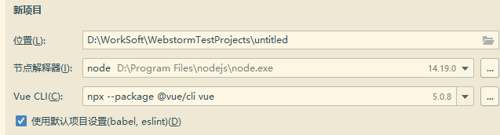

# iotx-web

## Project setup 安装

```
npm install
```

### Compiles and hot-reloads for development 开发版启动

```
npm run serve
```

### Compiles and minifies for production 生产版启动

```
npm run build
```

### Lints and fixes files 修复文件

```
npm run lint
```

### 创建与版本

```
vue cli创建，vue版本是3
```


